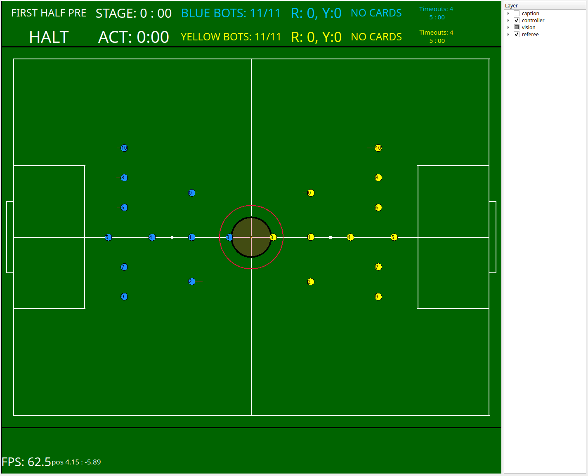

# CON-SAI 

[](https://github.com/SSL-Roots/consai_ros2/actions/workflows/build_lint.yaml)

CON-SAIはRoboCup SSLに 初めて参加する人でも開発できるサッカーAIです。

**CON-SAI** stands for **CON**tribution to *S*occer **AI**.



## Requirements

- Linux OS
    - Ubuntu 22.04 tested and is recommended
- ROS 2
    - [Humble Hawksbill](https://docs.ros.org/en/humble/Installation.html)
    - [colcon build tool](https://docs.ros.org/en/humble/Tutorials/Colcon-Tutorial.html)
- [consai_frootspi_msgs](https://github.com/SSL-Roots/consai_frootspi_msgs)
    - CON-SAIと[FrootsPi](https://github.com/SSL-Roots/FrootsPi)が通信するために必要なパッケージです
- RoboCup SSL Official Softwares (Optional)
    - [grSim](https://github.com/RoboCup-SSL/grSim)
    - [ssl-game-controller](https://github.com/RoboCup-SSL/ssl-game-controller)


## Installation

### Docker

```sh
docker pull ghcr.io/ssl-roots/consai_ros2:main
```

Dockerを用いたCON-SAIの開発方法については[.docker/README.md](.docker/README.md)を参照してください

### Source build

```sh
# Setup ROS environment
source /opt/ros/humble/setup.bash

# Create working directory
mkdir -p ~/ros2_ws/src
# Download consai_ros2
cd ~/ros2_ws/src
git clone https://github.com/SSL-Roots/consai_ros2.git
git clone https://github.com/SSL-Roots/consai_frootspi_msgs.git
git clone https://github.com/SSL-Roots/frootspi_msgs.git

# Install dependencies
rosdep install -r -y -i --from-paths .

# Build & Install
cd ~/ros2_ws
colcon build --symlink-install
# Setup working directory's environment
source ~/ros2_ws/install/setup.bash
```

## Quick start

```sh
# Start grSim and ssl-game-controller, then
source ~/ros2_ws/install/setup.bash
ros2 launch consai_examples start.launch.py game:=true
```

CON-SAIの使い方は[consai_examplesのREADME](./consai_examples/README.md)を参照してください。

## Packages

- consai
  - メタパッケージ
- consai_examples
  - CON-SAIの各種パッケージを使ったサンプル集です
- consai_msgs
  - CON-SAIで使用するデータ型を定義するパッケージです
- consai_robot_control_utils
  - ロボットの走行制御をテストするためのパッケージです
- consai_robot_controller
  - ロボットの走行、キック、ドリブル制御を担うパッケージです
- consai_vision_tracker
  - ビジョン情報をフィルタリングするパッケージです
- consai_visualizer
  - ビジョン情報やロボットの走行情報を描画するパッケージです
- consai_visualizer_msgs
  - consai_visualizerで使用するデータ型を定義するパッケージです
- robocup_ssl_comm
  - SSL-Vision、SSL-Game-Controller、grSimのデータパケットをROS 2のトピックに変換するパッケージです
- robocup_ssl_msgs
  - SSL-Vision、SSL-Game-Controller、grSimのデータプロトコルをROS 2のデータ型に再定義するパッケージです

## License

(C) 2021 Roots

各ファイルはファイル内に明記されているライセンスに従います。
ライセンスが明記されていない場合は、Apache License, Version 2.0に従います。
ライセンスの全文は[LICENSE](./LICENSE)から確認できます。

## Development

CON-SAIを開発する際にこの項目を読んでください。

### 開発方針について

- 本ソフトウェアはオープンソースですが、開発はオープンではありません
- チームの開発方針を優先するため、外部からのIssue、Pull Requestには対応できない場合があります

### Lint

コードの見た目を整えるためにlintでチェックしています。

下記コマンドを実行して、チェックを実行してください。

```sh
$ cd ~/ros2_ws
# 全てのパッケージのテストを実行
$ colcon test
# あるいは、パッケージ名指定でテストを実行
$ colcon test --packages-select robocup_ssl_comm 
# テスト結果を表示
$ colcon test-result --verbose
```

C++のコードは`ament_uncrustify`を使って、自動で整形できます。

```sh
# フォーマットのチェック
$ ament_uncrustify robocup_ssl_comm/src/vision_component.cpp
# --reformat オプションで自動整形
$ ament_uncrustify --reformat robocup_ssl_comm/src/vision_component.cpp
```

Pythonのコードは`ament_flake8`を使って、フォーマットとチェックできます。
自動整形はできません。

```sh
$ ament_flake8 consai_examples/consai_examples/control.py
```

外部ツール（例：autopep8）を使えば自動整形できます。
[ROS 2のPythonコードスタイル](https://docs.ros.org/en/humble/Contributing/Code-Style-Language-Versions.html#python)
に沿うようにパラメータを設定してください。

```sh
$ sudo apt install python3-autopep8

# 1行の100文字に制限
# -i オプションで自動整形
$ autopep8 --max-line-length 99 -i consai_examples/consai_examples/control.py
```
