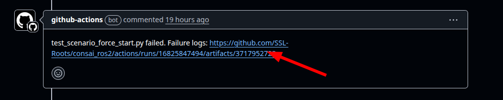
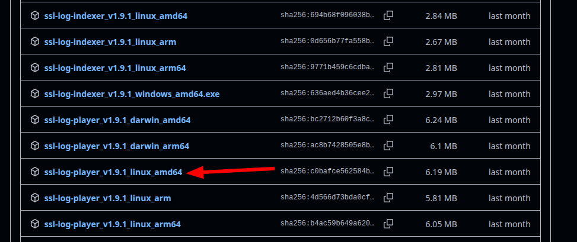

# CIが出力するシナリオログ結果の再生方法

PRを作成すると、CIがシナリオテストを実行します。
テストに失敗するとPRのコメントにログファイルが投稿されます。
このログファイルを再生することで、どのようにテストが失敗したのかを確認できます。

## ログファイルのダウンロード

コメントにあるログファイルのURLをクリックして、ログファイルをダウンロードします。



ダウンロードしたZIPファイルを展開します。


```sh
$ unzip test_scenario_force_start.py-failure-logs.zip

Archive:  test_scenario_force_start.py-failure-logs.zip
  inflating: test_scenario_force_start_test_shoot_at_force_start.log.gz  
```

gzファイルが表示されたらOKです。

## consaiを起動する

ログファイルの再生結果を表示するため、consaiを起動します。
この時点では何も描画されません。

シミュレータとssl game controllerは起動しないでください。

```sh
$ ros2 launch consai_game start.launch
```

## ログファイルを再生する

RoboCup SSL公式のログツールを使ってログファイルを再生します。

```sh
$ ./ssl-log-player -file test_scenario_force_start_test_shoot_at_force_start.log.gz 
```

再生すると、ビジョンとレフェリーの情報が描画されます。

### ログツールのダウンロード

ログツールは`RoboCup-SSL/ssl-go-tools`リポジトリからダウンロードできます。

まず、
[https://github.com/RoboCup-SSL/ssl-go-tools/releases](https://github.com/RoboCup-SSL/ssl-go-tools/releases)
にアクセスします。

`ssl-log-player_`で始まるファイルをダウンロードソマし。
使用環境に合わせたファイルを選択してください。



簡単に使うためファイル名を変更します。

```sh
$ mv ssl-log-player_v1.9.1_linux_amd64 ssl-log-player
```

実行権限を与えます。

```sh
$ chmod +x ssl-log-player
```
