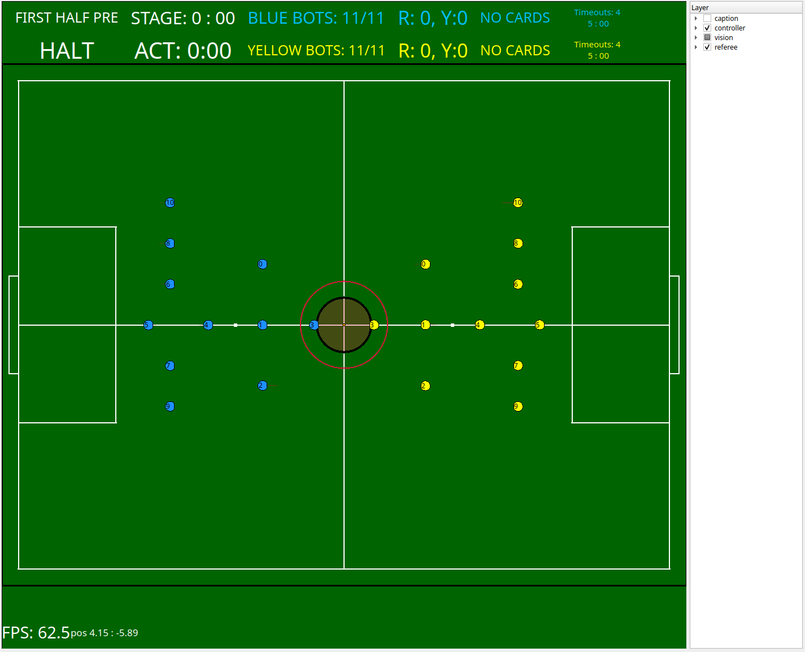

# consai_examples

CON-SAIの使い方がわかるチュートリアルパッケージです。

- [consai\_examples](#consai_examples)
  - [Robocup SSLソフトウェアの設定](#robocup-sslソフトウェアの設定)
  - [consai\_vision\_trackerでビジョンの情報を取得する](#consai_vision_trackerでビジョンの情報を取得する)
  - [consai\_robot\_controllerでロボットを動かす](#consai_robot_controllerでロボットを動かす)
  - [ロボット、ボール情報を上下左右反転する](#ロボットボール情報を上下左右反転する)
  - [黄色チームのロボットを動かす](#黄色チームのロボットを動かす)
  - [refereeコマンドに合わせてロボットを動かす](#refereeコマンドに合わせてロボットを動かす)
  - [ロボットに役割を与える](#ロボットに役割を与える)
  - [試合をする](#試合をする)
  - [CON-SAI vs CON-SAIで試合をする](#con-sai-vs-con-saiで試合をする)
  - [ロボットの実機を動かす](#ロボットの実機を動かす)


## Robocup SSLソフトウェアの設定

Vision（SSL-Vision、grSim）、Referee（SSL Game Controller）、Sim（grSim）
のデータ配信先アドレスとポートを設定します。

- Vision
  - アドレス: 224.5.23.2
  - ポート: 10006
- Referee
  - アドレス: 224.5.23.1
  - ポート: 10003
- Sim
  - アドレス: 127.0.0.1
  - ポート: 20011

## consai_vision_trackerでビジョンの情報を取得する

次のコマンドを実行します。

```sh
ros2 launch consai_examples start.launch.py
```

ビジュアライザが起動し、ビジョンの情報が表示されます。



ウィンドウ右側にあるLayerの各項目にチェックを入れることで、
表示コンテンツをON/OFFできます。

## consai_robot_controllerでロボットを動かす

次のコマンドを実行します。
このコマンドは、ビジュアライザだけでなくロボットコントローラも起動します。

```sh
ros2 launch consai_examples start.launch.py
```

別のターミナルで、pythonスクリプトを実行します。

```sh
ros2 run consai_examples control.py
```

### 解説

`control.py`は`consai_robot_controller`の使い方を知るためのスクリプトです。

引数の`example`をセットするとロボットの動きを変更できます。

```sh
# ヘルプの表示
ros2 run consai_examples control.py --help
...
--example EXAMPLE  実行したい関数の番号
                     0: move_to
                     1: chase_ball
                     2: wait_ball_and_shoot
                     3: receive_ball_and_shoot
                     4: pass_ball_between_robots
                     5: move_to_between_ball_and_center
                     6: defend_our_goal

# 2: wait_ball_and_shootを実行
ros2 run consai_examples control.py --example=2
```

## ロボット、ボール情報を上下左右反転する

`consai_visition_tracker`の`invert`パラメータを`True`にすると、
ロボットとボールの情報を上下左右反転できます。

これは、試合プログラムを変更しなくてもコートチェンジできるため便利です。

次のようにコマンドを実行すると、'invert'パラメータを'True'にできます。

```sh
# 引数invert:=trueを追加
ros2 launch consai_examples start.launch.py invert:=true

# ロボットを動かす
ros2 run consai_examples control.py
```

## 黄色チームのロボットを動かす

黄色チームのロボットを動かす場合は次のようにコマンドを実行します。

```sh
# 引数yellow:=trueを追加
ros2 launch consai_examples start.launch.py yellow:=true

# pythonの引数--yellowを追加
ros2 run consai_examples control.py --yellow
```

## refereeコマンドに合わせてロボットを動かす

次のコマンドを実行して、コントローラを起動します。

```sh
ros2 launch consai_examples start.launch.py
```

別のターミナルで、pythonスクリプトを実行します。

```sh
ros2 run consai_examples control_by_referee.py
```

レフェリー信号を切り替えると、次のようにログが表示され、ロボットの動きが変わります。

```sh
[INFO] [1708672811.560434873] [operator]: blueロボットを動かします
[INFO] [1708672811.562706550] [referee_parser]: ourteamはblueです
halt
HALTではロボットを動かしてはいけません
ロボットが止まるまでに2秒の猶予があります
stop
STOPでは、全てのロボットは1.5 m/s未満に減速しなければなりません
全てのロボットはボールから0.5メートルの距離を取らなければなりません
ボールを蹴ったりドリブルしたりしてはいけません
```

### 解説

`control_by_referee.py`は`referee`トピックの使い方を知るためのスクリプトです。

## ロボットに役割を与える

<details>

<summary>現在、サンプルメンテナス中です</summary>

~次のコマンドを実行して、コントローラを起動します。

```sh
ros2 launch consai_examples start.launch.py
```

別のターミナルで、pythonスクリプトを実行します。

```sh
ros2 run consai_examples control_with_role.py
```

### 解説

`control_with_role.py`はロボットへのゴールキーパーやアタッカー、
ディフェンス等の役割を与え方を知るためのスクリプトです。

ゴールキーパはスクリプトのオプション`--goalie`で変更できます。

ロボカップSSLのルールでは、ゴールキーパを自由に変更できないため、
スクリプト内でもIDを固定しています。

```sh
# 逆サイドの黄色ロボットを動かす場合
ros2 launch consai_examples start.launch.py yellow:=true invert:=true

# ゴールキーパのIDを2とする
ros2 run consai_examples control_with_role.py --goalie 2 --yellow
```

</details>

## 試合をする

`start.launch.py`に引数`game:=true`をセットすると、試合用のスクリプトが起動します。

```sh
ros2 launch consai_examples start.launch.py game:=true
```

また、黄色ロボットを動かすための`yellow`、
逆サイドで動かすための`invert`、
ゴールキーパーIDの`goalie`オプションも設定できます。

```sh
# 黄色ロボットを動かす かつ
# 逆サイド かつ
# ゴールキーパのIDが2
ros2 launch consai_examples start.launch.py game:=true yellow:=true invert:=true goalie:=2
```

## CON-SAI vs CON-SAIで試合をする

環境変数`ROS_DOMAIN_ID`を設定することでROSのネットワークを分離できます。

これを応用して、CON-SAI vs CON-SAIで試合ができます。

```sh
# 青色チームを起動
ROS_DOMAIN_ID=1 ros2 launch consai_examples start.launch.py game:=true

# 別のターミナルで、逆サイドの黄色チームを起動
ROS_DOMAIN_ID=2 ros2 launch consai_examples start.launch.py game:=true yellow:=true invert:=true
```

## ロボットの実機を動かす

CON-SAIは[FrootsPi](https://github.com/SSL-Roots/FrootsPi)
を搭載したロボットを動かすことができます。

FrootsPi側の`ROS_DOMAIN_ID`と同じものを設定し、`start.launch.py`を実行してください。
