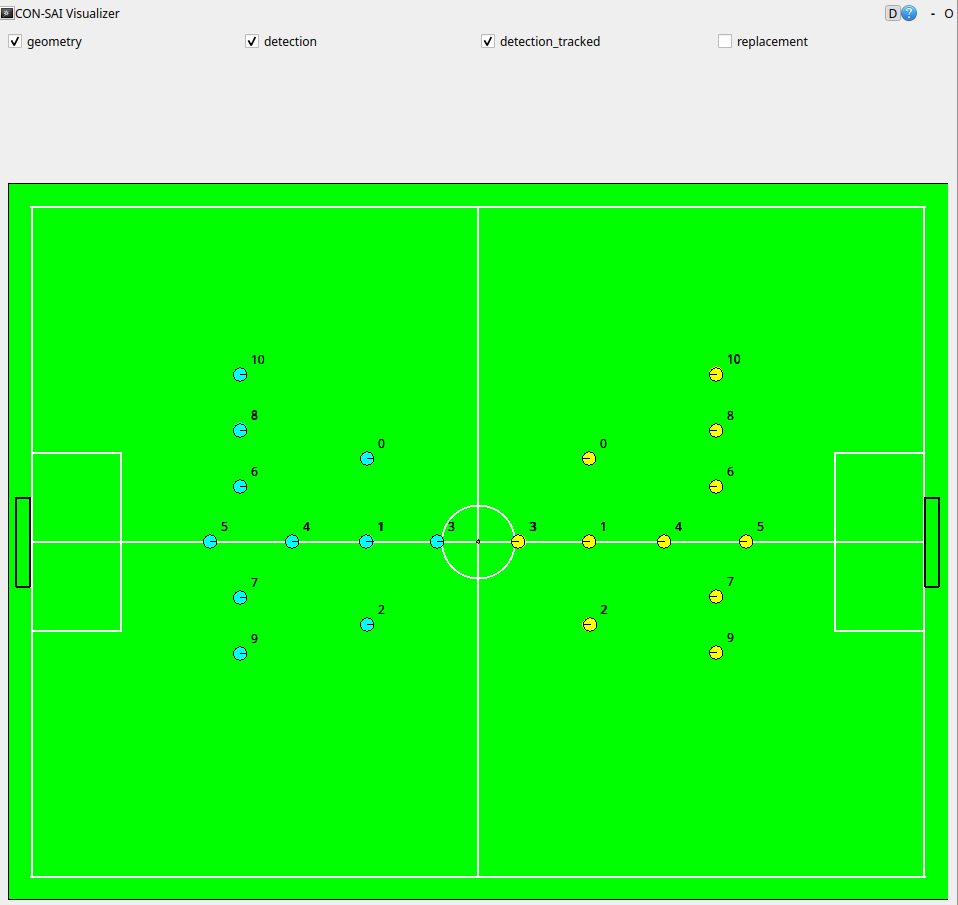

# consai_examples

CON-SAIの使い方がわかるチュートリアルパッケージです。

## consai_vision_trackerでビジョンの情報を取得する

次のコマンドを実行します。

```sh
$ ros2 launch consai_examples start.launch.py
```

ビジュアライザが起動し、ビジョンの情報が表示されます。



`/geometry`トピックがフィールド形状データです。

`/detection`トピックがビジョンの未加工データです。

`/detection_tracked`トピックが、フィルタリング加工されたビジョンデータです。

## consai_robot_controllerでロボットを動かす

次のコマンドを実行して、コントローラを起動します。

```sh
$ ros2 launch consai_examples start.launch.py
```

別のターミナルで、pythonスクリプトを実行します。

```sh
$ ros2 run consai_examples control.py
```

### 解説

`control.py`は`consai_robot_controller`の使い方を知るためのスクリプトです。

`main()`内のコメントをON/OFFすることで、様々な動きを試せます。

```python
def main(target_is_yellow=False):
    # test_move_to()
    # test_move_to_normalized(3)
    # test_chase_ball()
    # test_chase_robot()
    # test_for_config_pid(test_theta=True)
    # test_shoot(1.0, 0.0)
    # test_pass_two_robots()
    test_pass_four_robots()
```

## ロボット、ボール情報を上下左右反転する

`consai_visition_tracker`の`invert`パラメータを`True`にすると、
ロボットとボールの情報を上下左右反転できます。

これは、試合プログラムを変更しなくてもコートチェンジできるため便利です。

次のようにコマンドを実行すると、'invert'パラメータを'True'にできます。

```sh
# 引数invert:=trueを追加
$ ros2 launch consai_examples start.launch.py invert:=true

# ロボットを動かす
$ ros2 run consai_examples control.py
```

## 黄色チームのロボットを動かす

黄色チームのロボットを動かす場合は次のようにコマンドを実行します。

```sh
# 引数yellow:=trueを追加
$ ros2 launch consai_examples start.launch.py yellow:=true

# pythonの引数--yellowを追加
$ ros2 run consai_examples control.py --yellow
```

## refereeコマンドに合わせてロボットを動かす

次のコマンドを実行して、コントローラを起動します。

```sh
$ ros2 launch consai_examples start.launch.py
```

別のターミナルで、pythonスクリプトを実行します。

```sh
$ ros2 run consai_examples control_by_referee.py
```

### 解説

`control_by_referee.py`は`referee`トピックの使い方を知るためのスクリプトです。

## ロボットに役割を与える

次のコマンドを実行して、コントローラを起動します。

```sh
$ ros2 launch consai_examples start.launch.py
```

別のターミナルで、pythonスクリプトを実行します。

```sh
$ ros2 run consai_examples control_with_role.py
```

### 解説

`control_with_role.py`はロボットへのゴールキーパーやアタッカー、
ディフェンス等の役割を与え方を知るためのスクリプトです。

ゴールキーパはスクリプトのオプション`--goalie`で変更できます。

ロボカップSSLのルールでは、ゴールキーパを自由に変更できないため、
スクリプト内でもIDを固定しています。

```sh
# 逆サイドの黄色ロボットを動かす場合
$ ros2 launch consai_examples start.launch.py yellow:=true invert:=true

# ゴールキーパのIDを2とする
$ ros2 run consai_examples control_with_role.py --goalie 2 --yellow
```
